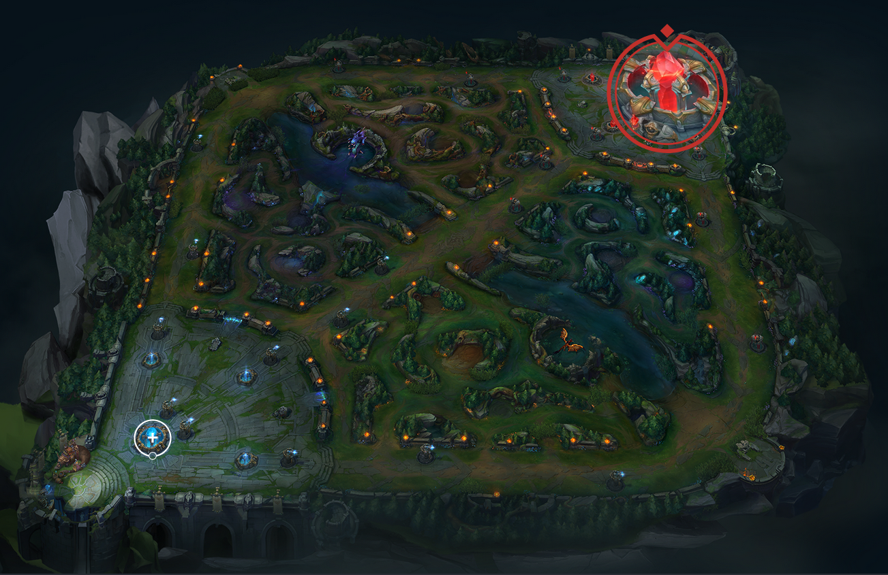
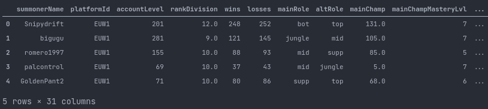
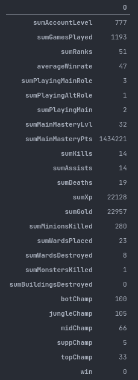
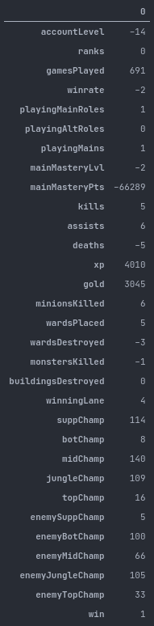
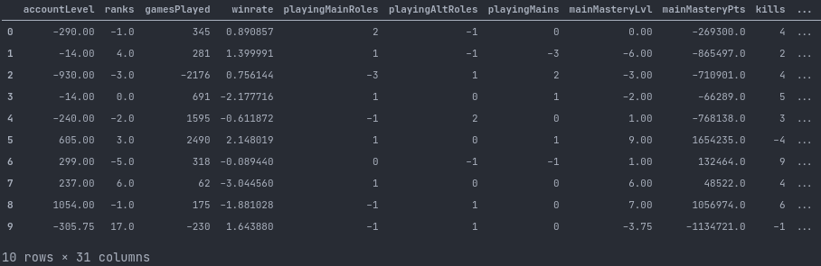
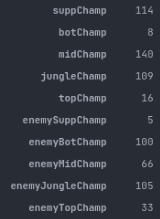

# leagueML

## Data
All the data gathered during the project is available here : https://drive.google.com/file/d/10JW-11G7nZtAMZpSqUaPNJwqSocORM8j/view?usp=sharing  
Use `tar -zxvf leagueML.tar.gz` to extract it. 
## Objectives

- Gather the first 15 minutes of data for ~80k League of Legends matches from the Riot API.
- Scrape players' data from `leagueofgraph.com`.
- Preprocess and engineer unusually structured data.
- Model the data to predict the match outcome.
  
## Introduction

- **What is League of Legends ?** (Only information relevant to the project will be covered.)  
  >League of Legends (LoL) is a competitive online strategy game developped by Riot Games.  
  >Two teams of 5 players, playing a *champion* of their choice (amongst a total of 151 champions) face each other, with the goal of destroying the enemy *Nexus*.  

  
  >Notice the three *lanes* joining the two bases together.  
  >The upper lane is called the *top* lane.  
  >The central lane is called the *mid* lane.  
  >The lower lane is called the *bot* lane.  
  >Everything in between is called the *jungle*.  
  >  
  >On these lanes are *towers*.  
  >It is necessary to destroy all the towers on at least one lane in order to reach the enemy base, and ultimately, their nexus.  
  >
  >Each players is assigned a role, which determine the lane the player has to play on.  
  >
  >Waves on minions are spawned in each bases and travel down the three lanes, eventually meeting on the lane, and fighting each other.  
  >Killing an enemy minion, or an enemy player grants gold and experience to the player.  
  >Gold can be used to buy equipment, making the player stronger.  
  >Experience can't be spent, but when enough is accumulated, the player *level up*, also making him stronger.  
  >  
  >In the early stage of the game, the players go on their respective lane and try to gather as much gold and experience as possible while trying to deny their opponent from doing so.  
  >  
  >Players can see their immediate surrounding and can also see what their teammates, and allied minions can see. They can also place *wards* on the ground, which allows the team to have vision in a small area of the map for some time.
  >  
  >The river traversing the map contain two pits, in which are *elite monsters* which, when killed provide a buff to the whole team.
  >  
  >That's pretty much all the information needed to understand the following sections, however the game and its concepts can be very complex, when played well.

- **Why the first 15 minutes of data per match ?**  
  >The first 15 minutes of a game represent what's called the early game, or laning phase.  
  >It is a known fact for the players that this is a very important phase in the game, and that a decisive edge can be gained by playing it well.  
  >Coincidentally, the players are allowed to forfeit the game after the 15th minutes, which added incentive for me to chose this number, as it would theorically be possible to use the model prediction to evaluate wether that is a sound choice.

## Data gathering

Each match has an associated ID, which can be used to request the match data to the Riot API.  
It turns out that gathering these IDs is really impractical, luckily for me, a user of the developer community surrounding the game uploads a list of 40k matches IDs to his website every week. You can find these [here](canisback.com/matchId). Kudos to [Canisback](https://github.com/Canisback).  
With these match IDs in hand, I built a pipeline to request the api for the data I needed.  
The request rate of the Riot API is quite limiting, and I had to gather the rest by scraping leagueofgraph.com for the players' data.  
After lightly processing some of the data, I packed it all up in `json` files.  
The code can be found in the `PipelineAPI.py` file.

Here is a peak at the data coming out of the pipeline.

```json
{
    "Player1": {
        "summonerName": "TheSoloLeveling",
        "platformId": "EUW1",
        "accountLevel": 300,
        "rankDivision": "Gold IV",
        "wins": 85,
        "losses": 88,
        "mainRole": "mid",
        "altRole": "top",
        "mainChamp": "Diana",
        "mainChampMasteryLvl": 6,
        "mainChampMasteryPts": 68457,
        "participantId": 1,
        "teamId": 100,
        "championId": 516,
        "role": "top",
        "level": 9,
        "xp": 5713,
        "totalGold": 4268,
        "minionsKilled": 74,
        "jungleMinionsKilled": 0,
        "kills": 2,
        "assists": 1,
        "deaths": 4,
        "wardPlaced": 3,
        "wardDestroyed": 0,
        "towerDestroyed": 0,
        "inhibitorDestroyed": 0,
        "dragonKilled": 0,
        "riftHeraldKilled": 0,
        "win": 0
    },

    [...]

    "Player10": {
        [...]
    }
```

The json main fields contains the data for all players, `Player1` to `Player5` correspond to the blue team, and `Player6` to `Player10` to the red team.
  
Let's review the different fields.

- `summonerName` is the player's username.
- `platformId` is the server the game was played on. (EUW, EUN, NA, JP)
- `accountLevel` is the player's account level.
- `rankDivision` is the player's rank, and division. It describes the level at which the player is.
- `wins` `losses` is the number of matches the player won/lost this season.
- `mainRole` `altRole` is the player's favored role, alongside his "fallback" role.
- `mainChamp` `mainMasteryLvl` `mainMasteryPts` is the player's most played champion, alonside his mastery level, and points.
- `participantId` is the participant Id in the match, it won't be useful, and I should have dropped that field.
- `teamId` is the player's team.
- `championId` represents the champion played by the player, we will later use a mapping list to translate it to the actual champion's name.
- `role` is the role the player played that match.
- `level` is the player's level at the 15th minute.
- `xp` is the player's experience at the 15th minute.
- `totalGold` is the player's gold at the 15th minute.
- `minionsKilled` `jungleMinionsKilled` are the number of minions killed at the 15th minute.
- `kills` `assists` `deaths` are the number of kills/deaths/assists for the player at the 15th minute.
- `wardPlaced` `wardDestroyed` are the number of ward placed and destroyed by the player at the 15th minute.
- `towerDestroyed` `inhibitorDestroyed` are the number of buildings destroyed by the player at the 15th minute.
- `dragonKilled` `riftHeraldKilled` are the number of elite monsters killed by the player at the 15th minute. The Baron Nashor and Elder dragon are not included as they spawn later in the game.
- `win` is the outcome of the match (boolean).

## Data Processing

### Imputing the missing values.

I used the team's mean value for `accountLevel` `rankDivision` `wins` `losses` `mainChampMasteryLvl` `mainChampMasteryPts`.  
For `mainRole` and `altRole` I calculated the distribution of players playing their main and alternative role in the data and used `role` to impute the missing values.  
I did the same thing for `mainChamp`, that is, calculate the distribution of players playing their main champion in the dataset, and filled the missing value using `championId` with the previously calculated distribution.  

### Engineering

I calculated the players' winrate using `wins` and `losses`.
I summed `minionsKilled` and `jungleMinionsKilled` as it doesn't result in information loss in our case.  
I encoded `rankDivision`, from a nominal category to an ordinal category, i'll explain why that makes sense in a bit.  
I then used a mapping list I got from another community API, to encode `championId`, to their name, renaming the feature to `champion` on which I used ordinal encoding once more, and did the same for `mainChamp` (again, I'll explain later).

To resume, we now have two pandas dataframe, one for each team, each row representing a player.  
Here's what it looks like:  


In its current form, the data is unusable, so I started thinking about the best ways to structure it.  
The first thing I tried was to concatenate all the rows for the two teams into one, and drop the useless features. I trained a basic model on this data, and got decent results (73% accuracy), but the data was scarce (hundreds of features), and messy, it didn't feel right.  
I started to wonder if summing/averaging the features for the 5 players in a team would be beneficial. On paper, there would be some information loss, as the data would no longer hold lane wise information, but I gave it a try.

Here's what it looks like:  
  
*(transposed for readability)*  

Most of it is pretty self explanatory, but I got rid of irrelevant features, and created the `playingMainrole`, `playingAltRole`, and `playingMain` features.  
I also preserved the champions played by each role.

Now, we have a dataframe like this one for both team, what's the best way to merge them ?  
Concatenation would work, but if we think about it, our model would have to figure out that there is a relation between the `sumGoldTeam1` and `sumGoldTeam2` for example.

The values will be different for every match, and what interest us isn't the amount of gold a team made by minute 15, but the gold difference between two teams. (I used gold as a example but this applies to most of the other features.)  
Once we aknowledge that, the solution is pretty straightforward, calculate the difference between the two teams.  

Here it is:  
  
*(transposed for readability)*

>I encoded `rankDivision`, from a nominal category to an ordinal category, i'll explain why that makes sense in a bit. 

Remember that? Well now is the time.
Having the ranks as an ordinal category is really convenient as independently of the rank at which the match is played, the difference range across the dataset will stay consistent.
  
We can see from the above image, that the ranks are balanced as there are no difference between the two teams, we can also see that our team has more games played this season than the other team, that our team has made more gold and experience in the first 15 minutes, and so on.

I also created the `winningLane` feature, by comparing the data for two players playing against each other on the same lane.

After processing all the matches, and packing everything, we now have a dataframe for the 80k matches, which isn't quite ready for modeling, but will soon be:  

 

The code for this part can be found in the `Processing.py` file.

## Encoding/Scaling

  
  
I needed to find a way to encode these features.
I tried different method, starting with a simple One Hot Encoding, of course that made the data very sparse (1510 features), not great.  
I then tried binary encoding, which was better, but still questionable.
I then thought about using the winrate for the champion played across the dataset instead of using the actual champion, and discovered **Weight of Evidence** encoding (WoE), which, by extension does just that.

I also normalized most of the other features with a robust scaler.

## Modeling  
(I'm writing this parts months after I wrote the others, sorry if things aren't as detailed here, but the modeling is really straighforward anyway)

I experimented with a bunch of models, and tree based models gave the best results. This isn't surprising given the nature of the data.

Sklearn's GradientBoostingClassifier() gave the best results out of the box, but XGBoost performed slightly better after doing some parameter optimization, and adequate feature dropping.

# Results

`~81%` accuracy (with KFold Cross Validation)

Not bad at all!
